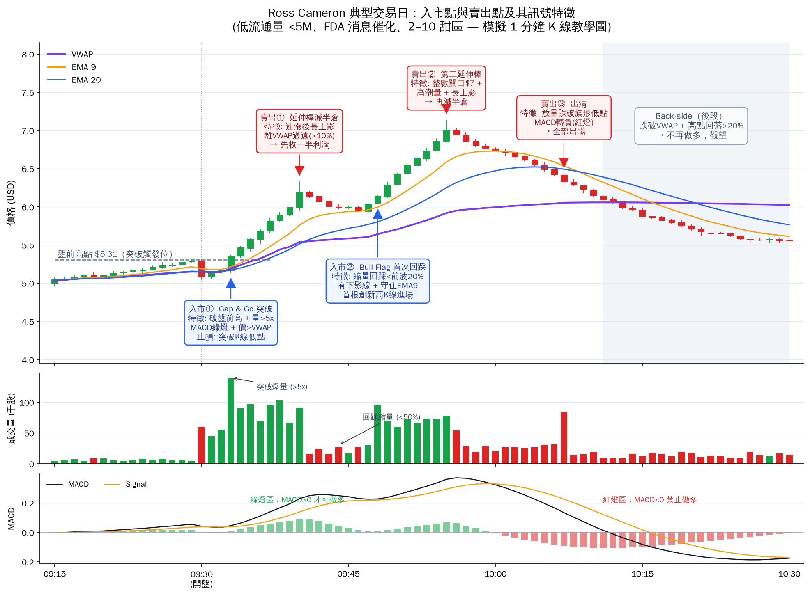

# Ross Momentum 交易訊號工具包

以 **Logic Analysis (Opus Warrior) 2026.03.26** 規則庫（83 條，從 Ross Cameron / Warrior Trading 影片字幕提煉）為基礎，回答三個實戰問題：

| 問題 | 對應交付物 |
|---|---|
| ① 來不及看盤，如何及時買賣？ | 本文「一、自動化路線圖」＋ `pine/` 警報腳本 ＋ `dashboard.html` 層三條件單 |
| ② 如何做層一/層二/層三看板＋條件單計算器＋警報？ | `dashboard.html`（瀏覽器直接打開即用）＋ 本文「二、三層架構」 |
| ③ 用圖表呈現 Ross 典型入市點/賣出點及訊號特徵 | `charts/ross_entry_exit_chart.png`（`generate_chart.py` 產生）＋ 本文「三、訊號特徵清單」 |

檔案結構：

```
trading-signal-analysis/
├── README.md                     ← 本文
├── dashboard.html                ← 三層看板（層一掃描評分/層二確認/層三條件單計算器+風控）
├── data/ross_rules.csv           ← 83 條規則機讀版（UTF-8 CSV，Excel 可直接開）
├── pine/
│   ├── ross_momentum_dashboard.pine    ← VWAP+EMA+MACD紅綠燈+警報（主指標）
│   ├── gap_and_go_alert.pine           ← 破盤前高+爆量 警報（入市①）
│   ├── bull_flag_first_pullback.pine   ← 首次縮量回踩突破 警報（入市②）
│   └── ema9_bandwidth_strategy.pine    ← EMA9 中線 + 帶寬擠壓 中短線波段【策略/可回測】
└── charts/
    ├── generate_chart.py         ← 圖表產生腳本
    └── ross_entry_exit_chart.png ← 典型交易日入市/賣出點標註圖
```

---

## 一、來不及看盤：把規則庫變成「機器盯盤、人只按鈕」

核心思路：**規則庫裡凡是有數字門檻的條目，都可以變成掃描器條件或警報；凡是「若A則B」的因果條目，都可以變成條件單（Conditional Order）**。你的角色從「盯盤」變成「盤前 15 分鐘準備 + 收到推播後 30 秒決策」。

### 每日流程（總共約 20 分鐘人工）

**盤前（規則 #36/#37：6:30 前完成觀察清單）**
1. 掃描器自動篩選：缺口 >4% ＋ Float <10M ＋ RVOL >5x（Trade-Ideas / TradingView Screener / Finviz Elite 皆可設）。
2. 打開 `dashboard.html` 層一，把掃描結果輸入 → 自動按五大標準評分，只留 4/5 與 5/5（規則 #8）。
3. 對留下的 2–3 隻，在 TradingView 各設好 `pine/` 三支腳本的警報（推播到手機）。
4. 在層三計算器輸入帳戶與預計入場/止損 → 得到 OCO 括號單參數，**直接在券商掛好條件單**（入場 Buy Stop-Limit ＋ 止損 Sell Stop ＋ 分批止盈 Sell Limit）。掛好之後不看盤也會自動執行。

**盤中（只處理推播）**
- 收到「Gap&Go 突破」推播 → 條件單已自動進場，不用動。
- 收到「MACD 轉紅燈」「放量跌破 VWAP」推播 → 手動平剩餘倉（或事先掛好的止損已處理）。
- 收到任何推播但層二檢查表有否決項 → 取消條件單，跳過。

**風控自動化（規則 #47/#48）**
- 券商端設定日最大虧損自動鎖倉（多數券商如 IBKR/Webull 支援）；或用層三的日盈虧欄位，工具會顯示「強制停止」。

### 沒空即時決策的三個層級（由淺入深）

| 層級 | 做法 | 工具 |
|---|---|---|
| 半自動（建議起點） | 盤前掛 OCO 括號單，警報只做「否決」用 | 券商條件單 + TradingView 警報 |
| 警報驅動 | 警報 → 手機一鍵下單（券商 App 預設好倉位模板） | TradingView Webhook → 手機推播 |
| 全自動 | TradingView 警報 Webhook → 券商 API 自動下單 | Alpaca / IBKR API + 小型伺服器；務必加上日最大虧損熔斷 |

> ⚠️ 全自動請先用模擬帳戶跑至少一個月。規則庫中 #33/#34（冷市縮倉）、#84（系統性危機停用策略）這類「市場環境開關」必須做進程式，否則自動化會在冷市把小虧損累積成大虧損。

---

## 二、層一 / 層二 / 層三看板架構（`dashboard.html`）

用瀏覽器直接打開 `dashboard.html` 即可使用（無需伺服器，資料存在本機 localStorage）。三層對應「**選股 → 確認 → 執行**」的漏斗：

### 層一：盤前掃描看板（每天 6:30 前）
- 市場溫度計（規則 #33/#71）：輸入今日漲幅 >30% 的股票數 → 自動判 Hot（倉位+50%）/ 中性 / Cold（倉位−50%）。
- 五大選股標準自動評分（規則 #8/#69）：股價 $2–10、Float<10M、漲幅前 3、RVOL>5x、消息催化劑（FDA > 臨床 > 大公司合作 > PP > 其他，規則 #39）。5/5 加倉、4/5 正常、≤3/5 不入場。
- Float<1M 自動標 🚀（規則 #6：極端擠壓獵場）；低 Float＋強消息自動標 ⭐（規則 #52）。

### 層二：入場前確認看板（開盤後，每次入場前 10 秒跑一遍）
- 5 項做多條件：MACD 綠燈（#24）、價>VWAP（#2）、量能確認（#68）、時間窗口（#30/#31）、形態清晰（#10/#13/#15）。
- 5 項否決條件（任一成立即放棄）：紅燈假突破（#25）、Back-side（#76）、Dump 訊號（#16）、主題第 3 天（#51）、中國股/仙股（#56/#78）。

### 層三：執行看板（條件單計算器 + 風控 + 警報）
- 輸入帳戶、風險 %、入場價、止損價 → 自動算出股數、OCO 括號單四張單的完整參數（可直接抄進券商）。
- 自動檢查盈虧比 ≥1.5（#45）、現金上限、滑價提示（#46）。
- 日最大虧損（#47）與峰值回吐 50%（#48）自動亮紅燈「強制停止」。

### TradingView 端的對應設定
1. Pine Editor 貼上 `pine/` 三支腳本 → 「加入圖表」。
2. 每支腳本的 `alertcondition` 在「警報」對話框選取，通知方式勾「App 推播 + 音效」。
3. 觀察清單 2–3 隻 × 3 支腳本 ≈ 6–9 個警報（免費帳戶警報數有限，Pro 以上較充裕）。
4. 想接自動下單：警報訊息填 JSON，Webhook URL 指向你的下單伺服器（Alpaca 免費 API 最易上手）。

---

## 三、Ross 典型入市點 / 賣出點與訊號特徵（`charts/ross_entry_exit_chart.png`)



圖為模擬的典型低流通量 Gap & Go 交易日（1 分鐘 K 線＋成交量＋MACD），標註兩個入市點、三個賣出點與 Back-side 禁區。**買入訊號特徵與賣出訊號特徵總結如下**（編號對應 `data/ross_rules.csv`）：

### 買入訊號特徵

| 入市點 | 觸發位 | 必要特徵 | 止損 | 規則 |
|---|---|---|---|---|
| ① Gap & Go 突破 | 盤前高點上方 1–2 美分 | 缺口>4%＋有消息；突破量>5x；MACD 綠燈；價>VWAP；9:30–9:45 窗口 | 突破 K 線低點 | #10 #24 #30 #68 |
| ② Bull Flag 首次回踩 | 回踩後首根創新高 K 線 | 回踩<前波 20%；回踩量<突破量 50%；有下影線；守住 EMA9；MACD 仍正 | 旗形低點 | #13 #15 |
| （加分）VWAP 站穩 | 回踩 VWAP 收盤站穩 | 收盤在 VWAP 上＋量縮 | 跌破 VWAP | #2 #4 |

**共同前提（缺一不可）**：股價 $2–10（#55）、Float<10M 最好 <5M（#5）、當日有消息催化（#39）、是「今天最明顯的股票」（#73）。

### 賣出訊號特徵

| 賣出點 | 動作 | 特徵 | 規則 |
|---|---|---|---|
| ① 第一延伸棒 | 減半倉 | 連續多根大陽後出現長上影；價格離 VWAP >10% | #3 #60 |
| ② 第二延伸棒 / 整數關口 | 再減半倉 | 高潮量＋長上影；碰整數關口（$7、$10…） | #53 |
| ③ 跌破旗形低點 | 全部出清 | 放量跌破整理低點；MACD 轉負（紅燈） | #16 #24 |
| Back-side 禁區 | 不再做多 | 從當日高點回落 >20–30%；跌破 VWAP | #76 #2 |

**出場紀律**：預設目標位再進場，用分批止盈對抗「恐懼提早止盈」（#60）；止損單一掛好就不取消，對抗「恐懼過晚止損」（#61）。

### 重現/修改圖表

```bash
pip install matplotlib numpy
cd charts && python3 generate_chart.py
```

改 `anchors`（價格劇本）和 `vol`（量能劇本）即可產生不同情境的教學圖；也可把真實 1 分鐘數據（yfinance 下載）餵入同一繪圖段落，標註自己的實際成交。

---

## 四、EMA9 帶寬中短線策略（`pine/ema9_bandwidth_strategy.pine`）

把 Bollinger Band 的 20 SMA 中線換成 9 EMA，上下軌 = EMA9 ± 2σ（或 ATR 倍數），並用 **Band Width = (上軌−下軌)/中線** 偵測「擠壓 → 擴張」：

- **進場 A 擠壓突破**：BW 落到 60 期最低附近（擠壓）→ 8 根內收盤突破上軌 + BW 擴張 + 量 > 1.5× 均量
- **進場 B 順勢回踩**：EMA9 上升中，價格回踩 EMA9 後以陽線收回中線之上
- **過濾**：MACD > 0（規則 #24）、價 > EMA50、量能確認（規則 #68）
- **出場**：初始止損 = 進場 K 下軌/低點；止盈 2R；收盤跌破 EMA9 移動出場
- **倉位**：每筆風險 1% 帳戶 ÷ 止損距離 = 股數（與層三計算器同一邏輯）
- 這是 `strategy()`，可直接在 TradingView 策略測試器回測；建議日線 / 4H。

## 免責聲明

本工具包整理自公開影片內容，僅供教育與研究用途，不構成投資建議。日內交易高風險，過往勝率不代表未來表現。
