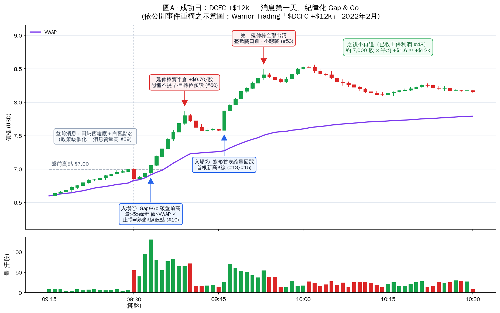
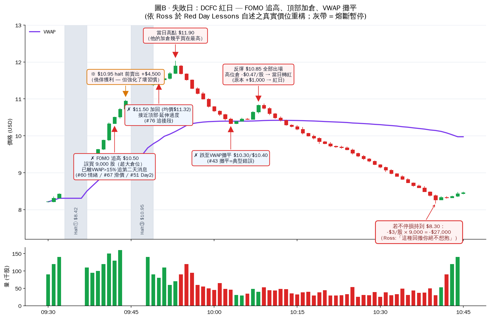

# Ross Cameron 成功日 vs 失敗日 對照案例：DCFC (Tritium)

> 同一隻股票、同一個消息事件窗口，一天 **+$12,000**、一天**轉紅** —— 差別不在選股，而在執行紀律。每一個決策點都對應 `../data/ross_rules.csv` 的規則編號。

## 為什麼選這個案例（資料來源說明）

Ross 最新的每日 recap（2026 年 6–7 月）影片與 warriortrading.com 部落格在本工作環境的網路政策下無法完整讀取（YouTube／warriortrading.com 被封鎖），只能取得摘要級資訊：**2026 年 6 月全月 +$37k、7 月 1 日 +$8k、6 月 16 日有一個紅日、7 月中已達成單月 $100k 目標**。因此本分析採用「**細節完整可查證**」的最佳對照案例——DCFC 事件窗口（2022 年 2 月 8–10 日），其中失敗日的每個價位都出自 Ross 本人在《Red Day Lessons》中的自述。文末附「用本 repo 工具自行分析最新影片」的指令，你在本地網路即可對 2026 年 6 月 16 日紅日重跑同樣的分析。

## 事件背景（公開可查證）

| 日期 | 事件 | 股價反應 |
|---|---|---|
| 2022/02/08 | Tritium 宣布田納西州 Lebanon 建 DC 快充工廠（500+ 職位） | **+39.5%** |
| 2022/02/08 | CEO Jane Hunter 進白宮，Biden 在電視演說中點名 Tritium | 情緒續燃 |
| 2022/02/09 | 白宮效應第二天，媒體全面轉載 | **+34.3%**，盤中高見 ~$15.70 |

消息質量按規則 #39 屬最高級（政策/白宮級 > FDA），這正是規則 #52「大公司/大人物名字在標題」的極端形態。

---

## 圖A · 成功日：+$12k（紀律化的第一天打法）



**他做對了什麼（規則對照）：**

| 決策 | 規則 | 說明 |
|---|---|---|
| 只在消息**第一天**進攻 | #51/#77 | 消息未 price-in，動能最純 |
| Gap&Go 破盤前高才入場 | #10 | 觸發位客觀、可預掛條件單 |
| 突破量 >5x 才追 | #68 | 無量突破一律不追 |
| 9:30–9:45 黃金窗口完成主要交易 | #30 | 之後只管理持倉 |
| 延伸棒賣半倉、第二延伸棒出清 | #60/#53 | 預設目標位對抗「恐懼提早止盈」 |
| 賺夠就收工 | #48 | 沒有回吐利潤 |

**成功訊號特徵**：催化劑最高級＋觸發位客觀（盤前高）＋量能確認＋分批止盈。整天只有兩次入場、兩次出場，全部發生在開盤 25 分鐘內。

---

## 圖B · 失敗日：紅日（同一隻股票，四個連環錯誤）



**Ross 自述的真實過程**（出處：Warrior Trading《Red Day Lessons》）：

1. 當天他先有約 **+$1,000** 的利潤，然後遇上 DCFC 開盤連環 halt up（$8.42 halt → 恢復續拉）。
2. **錯誤①** FOMO 追高 $10.50，而且**誤按熱鍵買了 9,000 股**（規則 #60 情緒交易、#67 大倉位滑價、#80 熱鍵誤操作風險）。
3. 股票拉到 $10.95 再度 halt，他在 halt 前賣出 **+$4,500** —— 僥倖獲利，但強化了壞習慣。
4. **錯誤②** 恢復交易後在 $11.50「首根創新高K線」加回（均價 $11.32）——但這已是第二天消息、離 VWAP 超過 10%、接近整數關口 $12（#51 Day 2 price-in、#76 追後段）。
5. 高點 $11.90 之後崩回 VWAP。**錯誤③** 他在 $10.30/$10.40 向下攤平（#43：虧損後應維持或縮小倉位，攤平是典型錯誤）。
6. 反彈到 $10.85 全部出場，高位倉平均虧損約 $0.47/股，當日由綠轉紅。
7. **他自己算過**：若不停損一路抱到 $8.30，等於 **-$3/股 × 9,000 股 = -$27,000**。「這種回撤你絕不想抱。」（*"You got to cut the losses. You got to learn from them. You got to move on."*）
8. **錯誤④（根因）** 他事後承認：核心問題是**冷市裡踩不住煞車**（#34：冷市加頻率交易是最常見錯誤）。

**失敗訊號特徵總結**：入場位置離 VWAP 太遠、追的是第 2 天已 price-in 的消息、倉位失控（9,000 股）、對虧損倉攤平、獲利後不收手。注意：**他的止損紀律仍救了他** —— $10.85 認賠出場避免了 -$27k 級災難，這正是規則 #61「恐懼過晚止損是最大錯誤」的反面教材成功執行。

---

## 兩天對照：同股不同命

| 維度 | 成功日 | 失敗日 |
|---|---|---|
| 消息階段 | 第 1 天（未 price-in） | 第 2 天（已 price-in，#51） |
| 入場位置 | 盤前高突破位，貼近 VWAP | 離 VWAP >10% 的延伸段 |
| 入場動機 | 預設計劃觸發 | FOMO 情緒（#60） |
| 倉位 | 計劃內 | 誤買 9,000 股（#67/#80） |
| 虧損處理 | 未觸發 | 向下攤平（#43） |
| 出場 | 延伸棒分批止盈（#53/#60） | 反彈認賠（正確！#61） |
| 當日心態 | 賺夠收工（#48) | 冷市不收手（#34） |

**核心教訓**：Ross 的成敗差異幾乎從不在「會不會選股」（兩天都是同一隻最明顯的股票 #73），而在**入場位置、消息天數、倉位控制、虧損處理**四件事。這四件事全部可以用本工具包的層二檢查表（否決條件）和層三計算器（倉位上限）機械化防呆。

---

## 用本 repo 工具分析 Ross 最新的成功/失敗影片

在你自己的網路環境（無 YouTube 封鎖）執行：

```bash
# 1. 列出頻道最新影片，找標題帶 +$ / RED DAY 的 recap
python3 ../../yt_channel.py "https://www.youtube.com/@DaytradeWarrior" --limit 30

# 2. 下載該影片字幕（例：2026/06/16 RED DAY RECAP）
python3 ../../yt_subs.py "https://www.youtube.com/watch?v=ZVM1OzsCRcc" -l en

# 3. 把字幕丟給 Claude，用同一套規則庫對照分析：
#    「請依 trading-signal-analysis/data/ross_rules.csv 分析這份字幕中
#      每筆交易遵守/違反了哪些規則，並輸出入場出場價位表」
```

之後把價位表填入 `generate_case_charts.py` 的 `anchors`，即可重現同款標註圖。

## 資料來源

- Warrior Trading — [Red Day Lessons With Ross Cameron](https://www.warriortrading.com/red-day-lessons-with-ross-cameron/)（失敗日全部價位出處）
- YouTube — [$DCFC +$12k | Day Trading Recap](https://www.youtube.com/watch?v=HWpXk33VIGA)、[Red Day Lessons $DCFC](https://www.youtube.com/watch?v=SiR8aleg--Y)
- The Motley Fool — [Why DCFC Rocketed on Tuesday (+39.5%)](https://www.fool.com/investing/2022/02/08/why-tritium-dcfc-limited-stock-rocketed-on-tuesday/)、[Why DCFC Is Electric Today (+34.3%)](https://www.fool.com/investing/2022/02/09/why-tritium-dcfc-stock-is-electric-today/)
- Electrek — [Tritium CEO to meet President Biden](https://electrek.co/2022/02/08/tritium-ceo-to-meet-president-biden-today-following-announcement-of-a-new-dcfc-manufacturing-facility-in-tennessee/)
- Business News Australia — [Tritium shares surge after Biden's White House shout-out](https://www.businessnewsaustralia.com//articles/tritium-shares-surge-64-per-cent-after-biden-white-house-shout-out.html)
- 2026 年近況：Warrior Trading — [June in Review +$37k and +$8K on the 1st Day of July](https://www.warriortrading.com/june-in-review-37k-and-8k-on-the-1st-day-of-july-happy-4th-of-july-week/)、[RED DAY RECAP (2026/06/16)](https://www.youtube.com/watch?v=ZVM1OzsCRcc)

> 免責聲明：圖A 為依公開事件重構之教學示意圖（Ross 未公開該日逐筆明細）；圖B 價位均出自 Ross 自述，但 K 線形狀為重構。僅供教育用途，不構成投資建議。
